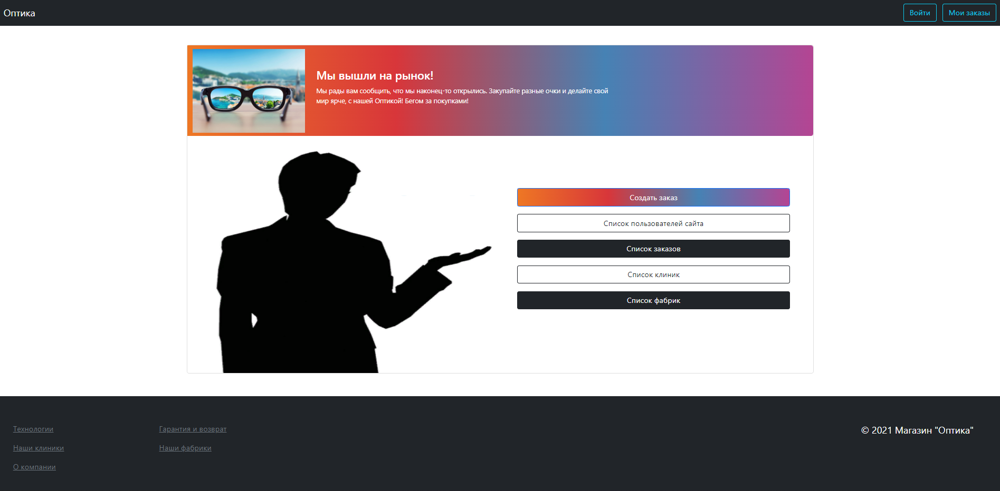
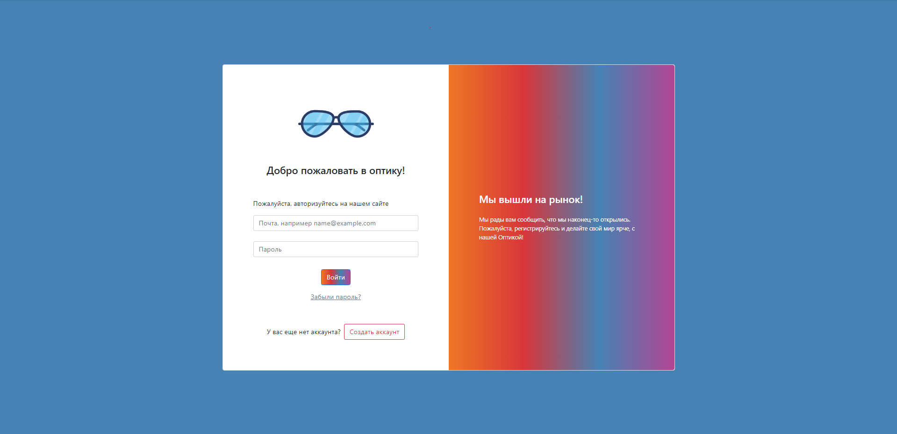
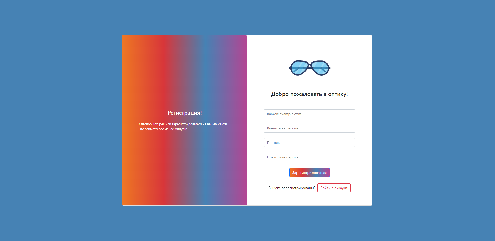
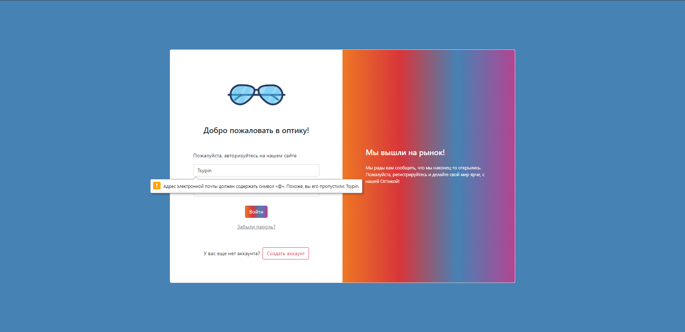

# OpticsStore
### This is my first C#(ASP.NET) project. The main idea is a shop selling glasses.  

## Project technologies stack
In this project I used:
### Patterns:
 - pattern MVC;
 - pattern Repository.
### Database:
 - [PostgreSql (DBMS)](https://www.postgresql.org/).
### ORM:
 - [Dapper](https://www.nuget.org/packages/Dapper).
### Encryption:
 - [BCrypt](https://www.nuget.org/packages/BCrypt.Net-Next) (for using Blowfish encryption algorithm).
### For views:  
 - [Razor Pages](https://docs.microsoft.com/en-us/aspnet/core/razor-pages/?view=aspnetcore-6.0&tabs=visual-studio&viewFallbackFrom=aspnetcore-2.1);
 - [Bootstrap 5](https://getbootstrap.com/).

## Site images:

